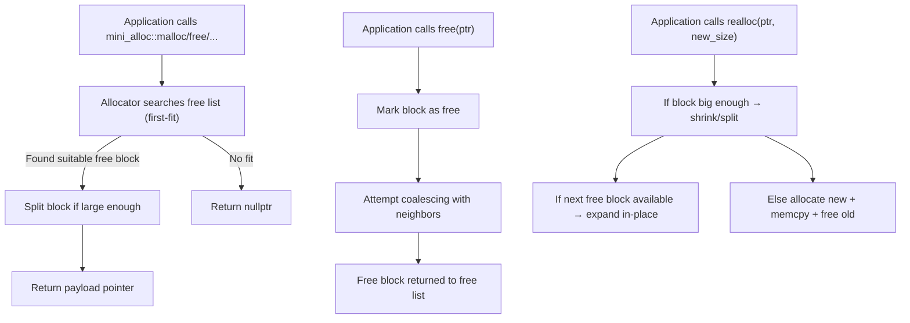
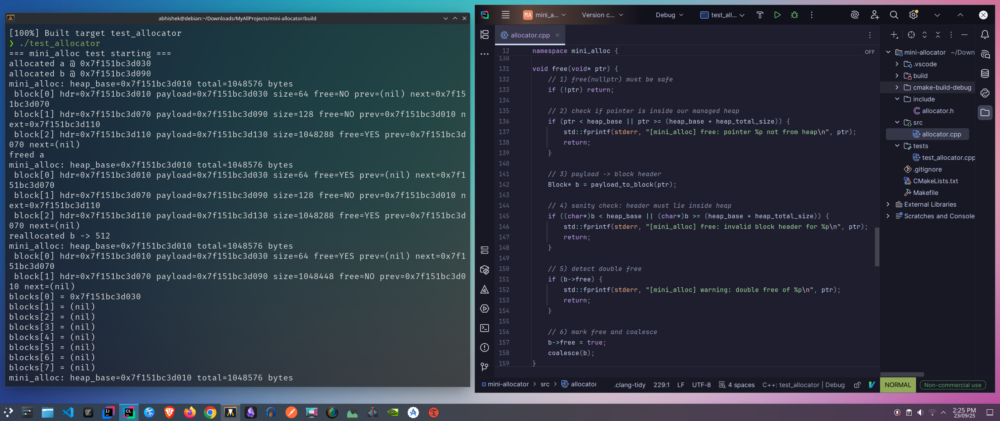

# Mini Allocator

A compact, self-contained **custom memory allocator** in **C++20**.
This project implements a simplified version of `malloc`, `free`, `realloc`, and `calloc` on top of a single contiguous heap buffer, simulating how low-level memory managers work.

The allocator demonstrates **splitting**, **coalescing**, **in-place `realloc`**, and alignment handling, all using a **boundary-tag style free list**.

**Note**: This is an **educational allocator**. It is single-threaded and uses one preallocated heap. It is not intended for production use, but to understand memory allocation internals.

---

## ✨ Features

* **Custom heap buffer** (allocated once, managed manually)
* **First-fit allocation strategy**
* **Splitting** large free blocks on allocation
* **Coalescing** adjacent free blocks on free
* **In-place `realloc`** (when possible), otherwise allocate–copy–free
* **Alignment** to `alignof(std::max_align_t)`
* **Safety checks** for invalid frees, double frees
* **Debug heap dump** to inspect block metadata

---

## 📂 Project Structure

```
mini-allocator/
├─ include/
│  └─ allocator.h        # Public API
├─ src/
│  └─ allocator.cpp      # Allocator implementation
├─ tests/
│  └─ test_allocator.cpp # Example + unit-style tests
├─ CMakeLists.txt        # Build system
└─ README.md             # This file
```

---

## 🔧 Build & Run (CMake)

```bash
# Clone and enter project
git clone https://github.com/Abhisheklearn12/custom-memory-allocator-cpp.git
cd mini-allocator

# Create build directory
mkdir build && cd build

# Configure and build
cmake ..
cmake --build .

# Run the test program
./test_allocator
```
### Note: For Re-run the project, follow this:
```
# Enter into the directory (it's its already built).
cd build

# Configure and build
cmake ..
cmake --build .

# Run the test program
./test_allocator
```
---

## 🏗️ Architecture

### High-level workflow



### Block Layout (memory representation)

```
+---------------------+
| Block Header        |
|  - size             |
|  - free flag        |
|  - prev / next ptrs |
+---------------------+
| Payload (aligned)   | <-- returned pointer
| ...                 |
+---------------------+
```

---

## ✅ Example Output

Sample run (addresses vary):





---

## What I Learned

### 🔹 How I Thought About It

* I started with the question: *how do `malloc` and `free` actually work under the hood?*
* I realized that all heap allocators need to track **used vs free blocks** in a contiguous memory buffer.
* The solution was to simulate this with a **custom heap array** and metadata (`Block` headers).

### 🔹 How I Tackled It

1. **Defined block metadata**: size, free flag, and prev/next links.
2. **Implemented `malloc`** using **first-fit** search.
3. Added **splitting logic** to avoid wasting space.
4. **Implemented `free`** with **coalescing** neighbors to reduce fragmentation.
5. Built **`realloc`**: try in-place expand → else allocate+copy.
6. Verified alignment correctness and added debug dump for introspection.

### 🔹 My Logic & Engineering Approach

* **Safety first**: checks for invalid pointers, double frees.
* **Clarity**: used plain C++20 with minimal dependencies, clear block layout.
* **Incremental testing**: wrote small tests (`malloc → free → realloc → calloc`) and inspected heap state after each operation.
* **Engineering tradeoffs**: chose single-threaded, single-heap for simplicity; this models real allocators but avoids OS/syscall complexity.

---

## Skills Gained

* Deep understanding of **manual memory management**.
* Practical experience with **boundary-tag allocators**, **fragmentation handling**, and **low-level pointer arithmetic**.
* Experience debugging **segmentation faults** with `gdb`.
* Reinforced difference between **RAII** and **manual allocators** --> here, we deliberately bypass RAII to reimplement what RAII normally hides.

---

## Next Steps (Possible Extensions)

* Add **thread-safety** (mutexes).
* Implement **best-fit** or segregated free lists.
* Replace heap buffer with **`mmap`/`VirtualAlloc`** for real OS-backed memory.
* Build a **visualizer** to show heap fragmentation in real-time.

#### Note: Will build its advanced version in another project like jemalloc(this is my goal) 
---

## Problems I Solved

During this project, I directly solved several real-world issues:

1. **Segmentation faults**

   * Root cause: invalid pointer arithmetic, inconsistent type (`void*` vs `char*`).
   * Fix: enforced consistent `char*` heap base and safe casts.

2. **Conflicting declarations**

   * Issue: `void* heap_base` vs `char* heap_base`.
   * Fix: unified declaration (`char*`) across `.h` and `.cpp`.

3. **Alignment bugs**

   * Solved by aligning all allocations to `alignof(std::max_align_t)`.

4. **Memory fragmentation**

   * Solved via block splitting and coalescing neighbors on free.

5. **Double free / invalid free**

   * Added pointer validity checks before marking blocks free.

6. **Realloc edge cases**

   * Implemented in-place expansion + fallback copy strategy.

These are **the same problems real allocator engineers face**, just scaled down.

---

## Applications of This Learning

This allocator project builds **core systems-level skills** applicable across domains:

1. **Operating Systems**

   * Real OS memory managers (`malloc`, `sbrk`, `mmap`) are built on the same concepts.
   * You now understand fragmentation, heap corruption, alignment --> critical OS-level concerns.

2. **High-Performance Systems**

   * Game engines, databases, HPC software often bypass `malloc` with custom allocators for speed.
   * You can now design **specialized allocators** (pool allocators, slab allocators, bump allocators).

3. **Blockchain & Smart Contracts**

   * Ethereum clients like **reth** optimize memory with custom allocators for performance.
   * WASM runtimes (used in blockchain) often require embedded allocators --> your knowledge transfers here.

4. **Security Engineering**

   * Many security exploits (heap overflow, use-after-free, double free) arise in allocators.
   * By building one, you now understand how attackers exploit allocators, and how defenses (like ASLR, hardened allocators) work.

5. **Embedded Systems / OS-less devices**

   * Microcontrollers can’t afford glibc’s `malloc` --> custom allocators are required.
   * This project is a foundation for writing memory-safe embedded software.

---
Quote:
```
I can not learn, what I can not create, that's the goal.
```
